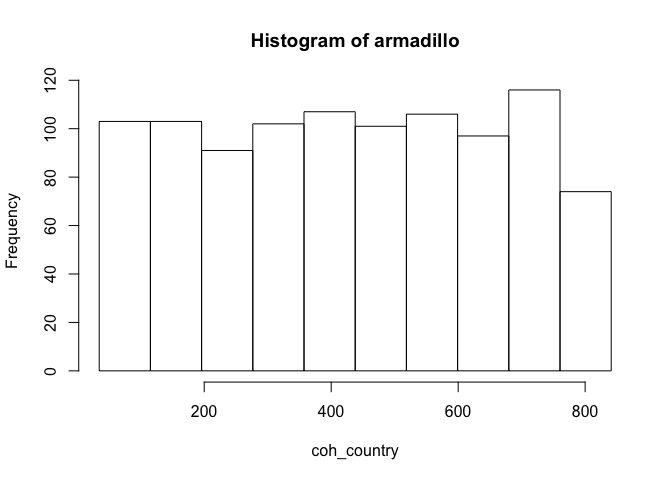

DSMolgenisArmadillo
================

<!-- README.md is generated from README.Rmd. Please edit that file -->
<!-- badges: start -->

<!-- badges: end -->

A DSI implementation for the [MOLGENIS Armadillo DataSHIELD
Service](https://github.com/molgenis/molgenis-service-armadillo/).

Overview
--------

You can use DSMolgenisArmadillo to analyse data shared in MOLGENIS
Armadillo servers using DataSHIELD. DataSHIELD allows execution of a
subset of analysis methods available in R. Methods such as:

`ds.mean()` `ds.glm()` `ds.lmerSLMA()`

For more detailed documentation check: <https://cran.datashield.org/>.

Installation
------------

You can install the released version of DSMolgenisArmadillo from
[CRAN](https://CRAN.R-project.org) with:

    install.packages("DSI")
    install.packages("DSMolgenisArmadillo")

The DataSHIELD Armadillo package is also available on the MOLGENIS CRAN
(<a href="https://registry.molgenis.org/repository/R" class="uri">https://registry.molgenis.org/repository/R</a>).
You can install it by executing the following code-block:

    install.packages("DSI")
    install.packages("DSMolgenisArmadillo", repos = "https://registry.molgenis.org/repository/R", dependencies = TRUE)

Make sure you install the DataSHIELD client (`dsBaseClient`) to perform
the actual analysis. This needs to be a client which is version 6.0.0 or
higher.

    # install the DataSHIELD client
    install.packages("dsBaseClient", repos = c("http://cran.datashield.org", "https://cloud.r-project.org/"), dependencies = TRUE)

Usage
-----

To use the DataSHIELD Armadillo client and perform analysis in
DataSHIELD there a few basic steps you need to take.

### Get a token from the ID server

    # Load the necessary packages.
    library(dsBaseClient)
    #> Loading required package: DSI
    #> Loading required package: progress
    #> Loading required package: R6
    library(DSMolgenisArmadillo)
    #> Loading required package: MolgenisAuth

    # specify server url
    armadillo_url <- "https://armadillo.dev.molgenis.org"

    # get token from central authentication server
    token <- armadillo.get_token(armadillo_url)

### Build the login frame

You need to specify the project, the folder and the table name(s) you
want to access.

    # build the login dataframe
    builder <- DSI::newDSLoginBuilder()
    builder$append(server = "armadillo",
                   url = armadillo_url,
                   token = token,
                   table = "gecko/2_1-core-1_0/nonrep",
                   driver = "ArmadilloDriver")

    # create loginframe
    logindata <- builder$build()

### Login and assign the data

Assigning the data means that you will assign the data to a symbol in
the analysis environment.

    # login into server
    conns <- datashield.login(logins = logindata, symbol = "core_nonrep", variables = c("coh_country"), assign = TRUE)
    #> 
    #> Logging into the collaborating servers
    #> 
    #> Assigning table data...

### Perform an analysis

DataSHIELD has a range of methods you can use to perform analysis.
Check: the
[dsBaseClient](https://cran.datashield.org/web/#client-packages)
documentation to see which methods are available.

    # calculate the mean
    ds.mean("core_nonrep$coh_country", datasources = conns)
    #> [1] "aggregate"
    #> `meanDS(core_nonrep$coh_country)`
    #> $Mean.by.Study
    #>           EstimatedMean Nmissing Nvalid Ntotal
    #> armadillo       431.105        0   1000   1000
    #> 
    #> $Nstudies
    #> [1] 1
    #> 
    #> $ValidityMessage
    #>           ValidityMessage 
    #> armadillo "VALID ANALYSIS"

    # create a histogram
    ds.histogram(x = "core_nonrep$coh_country", datasources = conns)
    #> [1] "aggregate"
    #> exists("core_nonrep")
    #> [1] "aggregate"
    #> classDS("core_nonrep$coh_country")
    #> [1] "aggregate"
    #> `histogramDS1(core_nonrep$coh_country,1,3,0.25)`
    #> [1] "aggregate"
    #> "histogramDS2(core_nonrep$coh_country,10,34.5963555689156,841.038183310907,1,3,0.25)"
    #> Warning: armadillo: 0 invalid cells

    #> $breaks
    #>  [1]  34.59636 115.24054 195.88472 276.52890 357.17309 437.81727 518.46145
    #>  [8] 599.10563 679.74982 760.39400 841.03818
    #> 
    #> $counts
    #>  [1] 103 103  91 102 107 101 106  97 116  74
    #> 
    #> $density
    #>  [1] 0.0012772155 0.0012772155 0.0011284137 0.0012648153 0.0013268161
    #>  [6] 0.0012524152 0.0013144159 0.0012028146 0.0014384175 0.0009176111
    #> 
    #> $mids
    #>  [1]  74.91845 155.56263 236.20681 316.85100 397.49518 478.13936 558.78354
    #>  [8] 639.42773 720.07191 800.71609
    #> 
    #> $xname
    #> [1] "xvect"
    #> 
    #> $equidist
    #> [1] TRUE
    #> 
    #> attr(,"class")
    #> [1] "histogram"

Documentation
-------------

Check the [package
documentation](https://molgenis.github.io/molgenis-r-datashield/articles/DSMolgenisArmadillo.html)
for details.
